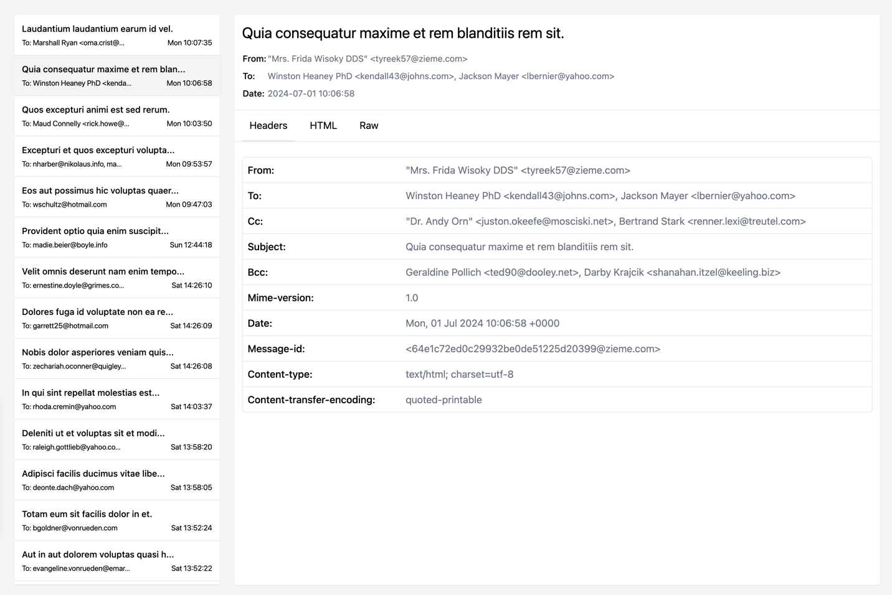

# 📨 Laravel Email Viewer

View and inspect all emails sent from your Laravel application.


## Introduction

Laravel Email Viewer is a package that allows you to view all emails sent from you application in the browser. This allows you to ensure your application has actually sent the mail. When using log as
an email driver for your local or staging environment, you can inspect emails without the need for external tools like Mailtrap or Mailhog, so emails never have to leave your server at all.

[](https://packagist.org/packages/axyr/laravel-email-viewer) [](https://github.com/axyr/laravel-email-viewer/actions?query=workflow%3ATests+branch%3Amain)

## Key features

* Log all application emails to a storage disk or database table
* Inspect HTML, attachments and email headers
* Packed with a simple Blade UI and a Vue.js/JSON controller
* Easily integrate in your existing application

## Documentation

[https://axyr.gitbook.io/laravel-email-viewer](https://axyr.gitbook.io/laravel-email-viewer)

## Usage

Outgoing emails will be automatically copied to a local disk or table, but you can work with this package manually as well with the Emails facade:

```php
<?php
use Axyr\EmailViewer\Facades\Emails;

Emails::create($mimeMessage);
Emails::find($fileNameOrId);
Emails::delete($fileNameOrId);
Emails::paginate(10);
Emails::prune();
Emails::server('database')->get();
```

## Quick start

> This package requires the PECL [mailparse](https://www.php.net/manual/en/book.mailparse.php) extension

Run the composer install command from the terminal:

```php
composer require axyr/laravel-email-viewer
```

Publish the database migration and configuration file:

```php
php artisan vendor:publish --provider="Axyr\EmailViewer\EmailViewerServiceProvider"
```

By default the package provides a set of routes for the Blade UI and the Vue UI. You can disabled them in the config file.

You can access the Blade UI by visiting:

```
https://your-host.tld/emails
```



To send a test email the package provides a simple Test command.
By default it will send to the laraval config value `mail.from.address`

```php
php artisan email-viewer:send-test --from=from@sender.tld --to=to@recipient.tld
```

For further information and customisation, visit our documentation page:

[https://axyr.gitbook.io/laravel-email-viewer](https://axyr.gitbook.io/laravel-email-viewer)
